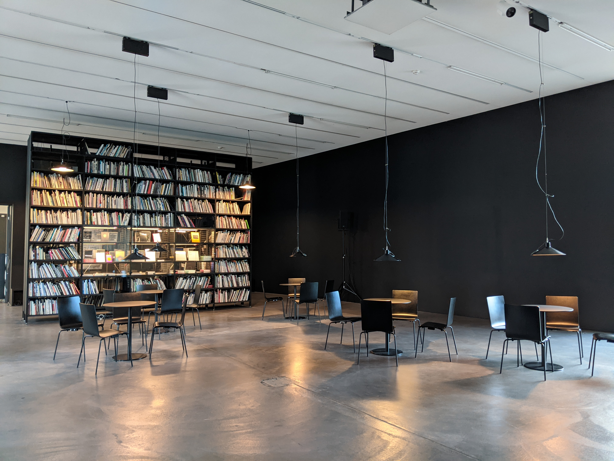

Dr Henri Laurie (Uni Cape Town, ZA), Julia Programming for Nervous beginners :

> "The kind of truth that is embodied in fine pottery is not same as the truth in beautiful poetry, and the
truth that is captured in a computer program is far from both of these. 
But in the end, all three forms use the expressive power of the medium to get at truth
...
>Programmers are, in that sense, like artists and poets"

\
Pictured : Kunstmuseum, Zürich (2023)

***
_Introduction_

These poems are like a revision of histories

Of yours, of mine, of somebody's

They are glimmers explained in cryptic themes

I pluck the root up to discover

My hands have moonshine before

And in poetry I build a home

For orphaned feelings to find lustre

***

## December heart
_Audrey Yeo_, Polyterasse, Zürich (2023)

That’s a December heart

Under autumn leaves that grew old

A funeral of dreams of once bright leaves

As if they had to gently cradle my soft heart

And fading spirit

Put a sad song on and watch the ceremony of my grieving

Leading down the isle

As we watch dreams leave for many miles

In the Zurich train

In the Lausanne line

Being in the middle

Hours at a time

The roof was my home

The passengers my neighbours

The families who harmed

Because their emotions were disabled

The in between being myself and what served them too easily

The in between of what served me and also left completely

I reached the altar

And left my aspirations there

Let the dapper flannel omit himself from his cruel dare

Let the ghost out of my head and hands

Let the facts trump hope

For my new low

Watched potentials undressed themselves

And felt my knee weakened a last amount

Found the author of my demise

Told her I loved her and to count her sadness twice 

Bought her new shoes and played her, her song

Said she could stay at the altar

Even after the darkness has gone

***
## The Push and Pull
_Audrey Yeo_, Famille Yeo, Basel Stadt (2023)

The tips of trees show their fingers

Of yellow leaves catching the sunrise

As if we all had the privilege

Of receiving autumn twice

The tips of trees show up as fringes

Of yellow brick roads ahead

My younger sister singing the Beatles

A lasting Sunshine at eight

The tips of my fingers don't feel the cold

Under puffy, bronze sleeves I afford

The roof over my head, some dignities I sold

Sometimes grateful and thankfully not

The glacial streams carved out my path

I was blessed by the Inn only twice

This girl who said she'd live in Basel

Arrived safely at the Rhine

I wish to hold hand-in-hand

With dreams I bear to fruit

My perceptions only catching up 

To all of the push and the pull

***
## The Night Cat
_Audrey Yeo_, Collingwood - Melbourne, Australia 

The brush of air gave her wings 

The wheels that travel at great length

In a city that bends hearts to its knees

The infectious giggle that she spreads

A heart that beats and sends the fuel

To tell the feet to instigate

A wheel in front, then a wheel behind

A city I share my traffic crimes

The crush of leaves in March and April

The soft wet grass with leaves of Maple

To Johnston street I turn the right

And meet rigidity at the red light

A clear September I stray from west

To watch the East Melbourne version of sun set

And frolic at night under the Melbourne rain

To see moonshine 

These tram tracks bring

I remember the nights of Irish banter

The orange dress, the multi-coloured encounters

The dark blue nights at the Night cat

The lacey, racey trapezius and my Innsbruck hat

At the Northcote bar

The Middle East Band playing has so far

Been the heartstrings that 

Bring on so much to remember, 

The girl in shoes from Smith, 

The Audrey Hepburn earrings on Brunswick

We were one of a kind

I liked that we kept our hearts open

Without ever questioning why

***
## Under the Water is the Sages
_Audrey Yeo_, Fitzoy Pool, Melbourne, Australia (2012)

It starts with a drizzle

And it hits your arms

You rise above and the view is marred

Racing grey moist is taken by clumps

The Banshee cries with the angry storm

You rise above the pool and hear

Her cries that dry all wounds beneath

And flutter as you catch on fear

That warmth and shelter isn't near

The wind that tends to whet each drop

Of Rain and sends you to a shock

But you find no way on land to go

Your sight improves as you swim below

Oh dear the view is Clarity

And now you see the route of forces

Of traps and diversions you can go

Your mind's at ease at even losses

And even when the water rises

And Banshee's blood is bled on it

Her cries aren't heard under the water

But my eyes do see where this path leads

The racing clouds do not stop

Fleeting past the ranges

Anarchy or peace it may tell

Under the water is the sages

***
## Tame
_Audrey Yeo_, Famille Yeo, Basel Stadt (2023)

It was a very short song

The universe sang to me

I didn't know I had to take it in

Before it promised nothing to me

I play the tune

Again and again

My body now knows

That I have been tamed

For the time wasted 

and meeting my own disinterest

I promise I will take notes

Because this isn't a first

It was a very short song

Based on a true story

But I will write myself the one

About Briefcase energies

***
## Briefcase energies
_Audrey Yeo_, Silhpost, Zürich (2023)

It's a competition because we regress

if one step is taken the other should be left

I dig into the underside of binary

It’s where we meet our match

Jars will break and butterflies, released

And then you'll hold my hand

The pink and purple amiss

Across the Zürich skies

Saw that I had been

Kissing famous boys

But I tire from lost souls and let them be

For eyes that follow me have briefcase energies

And the binary of this underside

I root for hearts with holes inside

It's where I met a catch

This human with his briefcase, a compass and a map

His chestnut eyes dissolve

The competition it involves

The pink and purple skies, 

I, the sun, and he the flower:

A proper briefcase might

***
## The prey becomes the hunter
_Audrey Yeo_, De Wette Park, Basel Stadt (2023)

The opened jar of butterflies

The hovering clouds of grey inside

The feet perched by her

Stabilizing the both of you

The Saccharine ways she was overdramatic and true

It was not a deceiving prose

She said she meant to say every single word

And yours spoke to block paths

Because you weren’t convince you deserved this much

Love and understanding has become confusing

To the brain that was damaged by the abusing

There, there, stay over there

She’s merely human so keep your truths and pick your dares

Wisely

For your lack of understanding has become abusive

Your honeyed words, they become self-serving

And the love you met on a Tuesday

May be worth protecting

***

## Marketplace
_Audrey Yeo_, Elisabethen Kirche, Basel Stadt (2023)

What will you do with a blank page

Will it be a story of morality and sage

I promised mine would be interesting when I was eight

Like the Levi's wearing brunette

Leaning against a rain-proof chair

Dapper in blue and collared for the evening

Ready to meet his future something

At the marketplace

A tight rope for me to walk in good faith

To pay things forward without knowing my steps ahead

But I liked that we met at the marketplace

And at my favourite route near Bankverein

I felt your dapper flannel leaning against mine

On purpose and several times

It was obvious that the Irish band playing was a sign

At the market place

Where you found sweetness in our morality and sage

And proceeded to tell me so

I was music to your ears

Till the night brought us home

***
## The ducks and Ama 
_Audrey Yeo_, at the Rhine, Kleinbasel side, Switzerland (2021)

I asked the ducks in the water

If they have seen my Ama

If the water they touch, touched her

If the streams they brush their feathers with

Held all five of her fingers on each of her hand

and tell her... we haven't let her go

and we will one day return

and be hand in hand like

the younger me she would not let go...

I wonder how to reach her

Knowing she is buried down under ...

Will the coffin disintegrate

and rain dilute her to the waters

Will she meet me in Switzerland ?

Where we can be together

Will my Akung's words be true ?

When he said :

"_We will always be with you_"

I know the ducks pass by: "Hello stranger!...

...Do you know my Ama ? ... She was _my_ grandma"

A favourite parent: she liked safety, having enough for us to eat, being clean.

She kept the children healthy

When there was dengue.

Do you know her... little duckies?...

Because in a lot of ways, _I am so much like her_ 

... sturdy, efficient and I like numbers

Will you tell her when you see her to not let us go ?

I know she hates complainers 

but I just miss her so.

***
## Sunshine for itself
_Audrey Yeo_, Rittergasse x Wettsteinbrücke, Basel Stadt (2023)

I don't know if you noticed

That spring ruined flowers

No shade for relief

No light to nourish

I don't know if you noticed

They took the sunshine for themselves

Nevermind the herbs abreasts

Or the chirping birds in the Innenhof confusing

The east and the west

I don't know if their petals learned

If they were worthy or not 

Will they find all their faces

And only chose one from the lot

The fall is near, 

Their buds already burned

What will sisters scheme next

If they have killed their competition ? 

***
## The Magic Green of the Rhine
_Audrey Yeo_, La Rhine x Burgweg, Switzerland (2021)

I see how this goes

When things between us start ending

I see the river course reversing

The steps back are crushing

The retracting amount to hurt

You know it was you who waved at me first

I,

See how this goes

When things between us start ending

I saw the sun hit the river and it gloat

The magic green of the Rhine turned to a ghost ...

Destabilizing my universe,

I thought I shared bounds of land with you

And we were mastering our respective fools

A reflection of sun by water

My stature so short did I ever reach the magic river

But the ocean soon came out to dissolve

Green jade of glacier from our mountain tops

The empty expecting mirth

You laughed out loud

Excused by the afternoon wind

It paralyzes me so I can never win

I was drenched by river 

or so I thought

I was once your lover

and now I am not

***