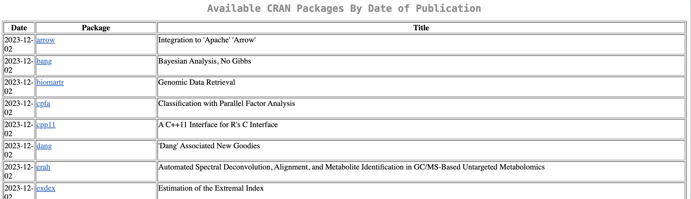

_I would like to acknowledge past and current colleagues who have enriched my knowledge of 
statistical software engineering_


\
Pictured : Alma Mater, University of Zürich, (2023)
\

---------------------------------

````
Fake  holidays (excerpt)


- Last performed Dec 26, Berlin

I love the slowest days of the year

The ones between real holidays 

Are real holidays

Magnifying my nothingness into lightness

The slowest of the days of the year

Are the kindest ...

````

---------------------------------

## Notes on columns and row binding and matrix multiplication

Let's attempt to get the solution from below

```{r}
knitr::include_graphics("images_lifesite/dotproduct.svg")
```


Pictured : Example of dot product from [Toppr](https://images.app.goo.gl/e8HYWYv5YPY67tqk7)

```{r}
first_matrix = matrix(c(1, 4, 2, 5, 3, 6), nrow = 2, ncol = 3)

second_matrix = matrix(c(7, 9, 11, 8, 10, 12), nrow = 3, ncol = 2)
```
```{r}
is_first0 = rbind(c(1, 2, 3), c(4, 5, 6)) # this is how you recreate a matrix
is_first1 = rbind(1, 2, 3, c(4, 5, 6))

print(is_first0)

print(is_first1)

identical(is_first0, first_matrix) # TRUE
identical(is_first1, first_matrix) # FALSE

```

```{r}
is_second = cbind(c(7, 9, 11), c(8, 10, 12))
identical(second_matrix, is_second)  # TRUE

```


The first matrix looks like:
```{r}
print(first_matrix)
```

The second matrix looks like:
```{r}
print(second_matrix)
```
 
When we try to do `first_matrix * second_matrix` gives `Error in first_matrix * second_matrix : non-conformable arrays`. It is correct indeed to multiply two matrices that have the same column of first_matrix, to the same row of second_matrix. In this case the dimensions are `3 x 2 multiplied by 2 x 3` The resulting matrix should be the row of first_matrix and the column of the second, therefore `2 x 2`.

The correct way to do it in `R` is:


```{r}
first_matrix %*% second_matrix
```

## Notes on choosing colours in R

```{r}
colorBlindGrey8   <- c("#999999", "#E69F00", "#56B4E9", "#009E73",
                       "#F0E442", "#0072B2", "#D55E00", "#CC79A7")
scales::show_col(colorBlindGrey8)


# show colours
scales::show_col(rainbow(50))

# show HEX code
rainbow(22)

# how to View colours
vir <- hcl.colors(10, palette = "Pastel 1", alpha = NULL, rev = FALSE, fixup = TRUE)

vir <- hcl.colors(10, palette = "Cold", alpha = NULL, rev = FALSE, fixup = TRUE)

vir <- hcl.colors(10, palette = "ag_GrnYl", alpha = NULL, rev = FALSE, fixup = TRUE)

vir <- hcl.colors(10, palette = "Oslo", alpha = NULL, rev = FALSE, fixup = TRUE)

vir <- hcl.colors(10, palette = "BurgYl", alpha = NULL, rev = FALSE, fixup = TRUE)

# show colours
scales::show_col(vir)

# show HEX code
vir


```


## What am I currently working on ?

I am working on an early drug development software for study statisticians and early development teams to evaluate probability of success within the Bayesian framework. 
The context of this work is in the oncology therapeutic area. This work will be presented in various talks in 2024. 
I am passionate about good engineering practices and am bringing this
package, written in R, to the state of art. I have a checklist that was requested to be shared from the useR!2024 presentation "Software Engineering: A Statistician's Journey" which will be pubsliehd here soon. Here is the open source repository of [`phase1b`](https://github.com/Genentech/phase1b) where I am the Lead developer of. What I enjoy about statistical software development is 
to create mathematically elegant solutions such that the solution is fit for purpose, 
and the facility is computationally robust. It ties my interest in probability theory and computer science together, along with my personal value of creating accessible infrastructures.

## What is a statistical software ?

Statistical software is a computing facility that provides a practical solution to
statistical analyses. It can be written in one or more computing languages such as
R, C++, Python, Julia or others. Usually the choice of language depends on the purpose of
the statistical analyses, target user and performance.

## Why would anybody be interested in statistical software ?

Statistical software have existed for decades. Good software produces results efficiently
and reproducibly, both can attend to the scientific question and good scientific practices.

## What is state of art engineering for statistical software ?

Mary Shaw, (2002) : "Acceptance of theirresults relies on the process of obtaining the results as well as analysis of the results themselves."

A good software tends to the principles of good scientific practice and good engineering practices.
This is not without a rigorous practice of testing code, reviewing code, writing clear 
and clean code and addressing the precise statistical question.

The rationale for good statistical engineering practices is first and foremost deliver a fit for purpose and robust facility that produces reproducible results. Clean and readable code
that is properly formatted and styled allows more efficient reviewing, reading and opens 
more doors for collaboration. These practices contribute to the ultimate goal of the best
product available for a statistical analysis need.

## What are examples of good statistical software ?

Statistical software that have been widely accepted are generally published in [CRAN, see pic below](https://cran.r-project.org/index.html) (The Comprehensive R Archive Network). Currently, there are over 20'000 packages on CRAN. 

<!-- Good examples are : -->

<!--  * [mmrm : Mixed Models for Repeated Measures](https://cran.r-project.org/web/packages/mmrm/index.html) -->
<!--  * [crmPack : Model-Based Dose Escalation Designs in R with crmPack](https://github.com/roche/crmPack) -->

## What is CRAN ?
CRAN hosts a central hub for information about R installation, R packages and documentation.
"CRAN operations, most importantly hosting, checking, distributing, and archiving of R add-on packages for various platforms, crucially rely on technical, emotional, and financial support by the R community." See more [here](https://cran.r-project.org/index.html).



References : 

[Shaw M (2002) _What makes good research in software engineering?_ International Journal of Software Tools for Technology Transfer, 2002, vol. 4, no. 1, pp. 1-7.](https://www.cs.cmu.edu/~Compose/ftp/shaw-fin-etaps.pdf)

<!-- [Sabanes Bove D, Dedic J, Kelkhoff D, Kunzmann K, Lang B, Li L, Stock C, Wang Y, James D, Sidi J, Leibovitz D, Sjoberg D (2023). mmrm: Mixed Models for Repeated Measures. R package version 0.3.6,](https://openpharma.github.io/mmrm/). -->

<!-- [Sabanés Bové D, Yeung WY, Palermo G, Jaki T (2019). “Model-Based Dose Escalation Designs in R with crmPack.” Journal of Statistical Software, 89(10), 1–22. doi:10.18637/jss.v089.i10.](https://github.com/roche/crmPack) -->

Got feedback ? Email me [here](mailto:comptesaudrey@gmail.com)
